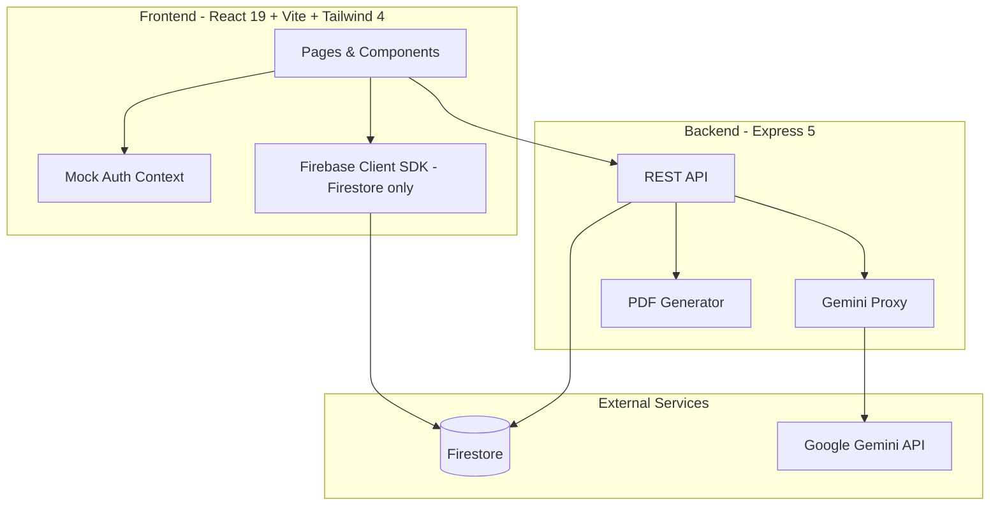
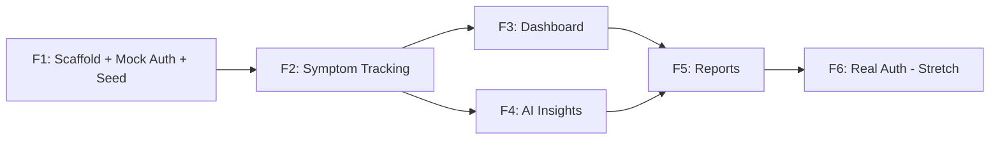

# Lunelle — Technical Specification

**Status:** Approved  
**Last updated:** August 22, 2026

---

## 1. Discovery Summary

### What Lunelle Is

Lunelle is an AI companion for women with **PMDD (Premenstrual Dysphoric Disorder)** — a cyclical mood disorder where symptoms reliably appear in the **luteal phase** (roughly days 14–28 of a 28-day cycle, or the week before menses) and resolve shortly after bleeding starts.

Unlike generic period trackers, Lunelle is built around **cycle-phase context**. Every symptom log, dashboard metric, AI insight, and report is anchored to **cycle day and phase**, because PMDD patterns only make sense in that frame.

### Target User (MVP)

A woman who suspects or has been diagnosed with PMDD and wants to:

- Log daily symptoms quickly (under 2 minutes)
- See how symptoms correlate with her cycle phase over time
- Get AI-generated pattern summaries she can trust (non-diagnostic, supportive)
- Export a **personal summary** for herself and a **clinician-ready PDF** for appointments

### Problem Lunelle Solves

| Pain point | Lunelle approach |
|---|---|
| Generic trackers ignore PMDD severity and cyclical timing | Cycle day/phase is first-class on every screen |
| Hard to see luteal-phase patterns across months | Dashboard charts symptoms by cycle phase |
| Difficult to communicate with clinicians | Structured PDF report with cycle-aligned symptom history |
| Isolation and confusion about "what's normal" | Gemini-powered insights grounded in the user's own data |

### MVP Scope

**In scope**

- Daily symptom tracking (11 DRSP-adapted symptoms + 1–6 severity + Impact + notes)
- Cycle tracking (period start, estimated cycle day, phase)
- Dashboard with cycle-aware visualizations
- AI insights via Google Gemini (server-side only)
- Two report formats: personal summary + clinician PDF (Impact / functional impairment surfaced in Reports)
- Mock logged-in user + seeded demo data
- Firebase Firestore wired up (data layer ready)
- Express 5 API proxy for Gemini and PDF generation

**Out of scope for MVP**

- Real Firebase Authentication (stretch, last)
- Social features, community, messaging
- Medication/supplement tracking
- Wearable integrations
- Multi-user / admin panels
- Native mobile apps (responsive web only)
- HIPAA compliance / formal medical device certification

### Key Domain Concepts

**Cycle phases (standard 28-day model, adjustable per user):**

- **Menstrual** — days 1–5 (bleeding)
- **Follicular** — days 6–13
- **Ovulatory** — days 14–16
- **Luteal** — days 17–28 (primary PMDD window)

**Severity scale:** 1–6 (not at all → extreme), matching IAPMD’s DRSP-adapted daily rating instrument.

### Architecture Overview



**Security principle:** Gemini API key and any server secrets live in Express `.env` only — never exposed to the browser.

### Mock Auth Strategy (Feature 1)

Instead of real login:

- A **hardcoded demo user** (`demo-user-001`) is always "logged in"
- Frontend `AuthContext` returns this user unconditionally
- All Firestore reads/writes use `users/{demoUserId}/...`
- Seed script populates ~90 days of realistic cyclical data
- UI shows a subtle "Demo Mode" badge; no login/signup screens
- Real Firebase Auth drops in later by swapping the auth provider — routes and data paths stay the same

---

## 2. Tech Stack

| Layer | Technology | Version | Notes |
|---|---|---|---|
| Language | JavaScript (JSX) | ES2022+ | Plain JS throughout — no TypeScript |
| Frontend framework | React | 19.x | Concurrent features, modern hooks |
| Build tool | Vite | 6.x | Fast HMR, ESM-native |
| Styling | Tailwind CSS | 4.x | CSS-first config (`@import "tailwindcss"`) |
| Routing | React Router | 7.x | Client-side SPA routing |
| Charts | Recharts | 2.x | Dashboard visualizations |
| Backend | Express | 5.x | REST API, middleware |
| Database | Firebase Firestore | — | NoSQL, real-time capable |
| Auth (stretch) | Firebase Auth | — | Email/password or Google OAuth |
| AI | Google Gemini | 2.0 Flash | Via `@google/generative-ai` on server |
| PDF | PDFKit | — | Clinician report generation |
| Package manager | npm | — | Separate `client/` and `server/` apps |

---

## 3. Repository Structure

Simple two-app layout — no npm workspaces, no `packages/` monorepo.

```
lunelle-pmdd-ai-companion/
├── README.md
├── .env.example                 # Template for server env vars
├── docs/
│   └── SPEC.md                  # This document
├── shared/                      # Plain JS modules imported by both apps
│   ├── symptoms.js              # 11 DRSP-adapted symptom definitions + Impact items
│   ├── cycle.js                 # Phase calculation utilities
│   └── constants.js             # Shared constants (severity labels, etc.)
├── client/                      # React frontend
│   ├── index.html
│   ├── vite.config.js
│   ├── package.json
│   └── src/
│       ├── main.jsx
│       ├── App.jsx
│       ├── contexts/
│       │   └── AuthContext.jsx      # Mock auth (swap later)
│       ├── hooks/
│       │   ├── useSymptomLogs.js
│       │   ├── useCycle.js
│       │   └── useInsights.js
│       ├── pages/
│       │   ├── Dashboard.jsx
│       │   ├── Track.jsx
│       │   ├── Insights.jsx
│       │   └── Reports.jsx
│       ├── components/
│       │   ├── layout/
│       │   ├── tracking/
│       │   ├── dashboard/
│       │   └── reports/
│       ├── lib/
│       │   └── firebase.js          # Firestore client init
│       └── styles/
│           └── index.css            # Tailwind 4 entry
├── server/                      # Express backend
│   ├── package.json
│   └── src/
│       ├── index.js
│       ├── routes/
│       │   ├── insights.js          # POST /api/insights/generate
│       │   └── reports.js           # POST /api/reports/generate
│       ├── services/
│       │   ├── gemini.js
│       │   └── pdf.js
│       ├── middleware/
│       │   └── errorHandler.js
│       └── scripts/
│           └── seed.js              # Populate demo data
└── firebase/
    ├── firestore.rules              # Dev-permissive, tighten for prod
    └── firestore.indexes.json
```

The `shared/` folder is plain JavaScript (not an npm package). Vite resolves it via a path alias in `client/vite.config.js`; the server imports it with relative paths.

---

## 4. Symptom Definitions (DRSP-adapted)

Eleven daily symptoms adapted from IAPMD’s DRSP-based clinical instrument — the tool used in practice to document PMDD patterns. Labels keep the clinical wording so logs stay clinician-readable. Categories remain for UI grouping only; diagnosis criteria are not applied by the app.

Each symptom has a **shortLabel** (Track UI — fast daily logging) and a **label** (full DRSP wording — expandable detail on Track + Reports / clinician surfaces).

| ID | shortLabel (Track) | label (full DRSP) | Category |
|---|---|---|---|
| `depressed_mood` | Depressed / sad | Felt depressed, sad, "down," hopeless, worthless, or guilty | mood |
| `anxiety` | Anxious / tense | Felt anxious, tense, "keyed up," or "on edge" | mood |
| `mood_swings` | Mood swings | Had mood swings, sensitivity to rejection, feelings easily hurt | mood |
| `anger` | Angry / irritable | Felt angry or irritable | mood |
| `reduced_interest` | Less interest | Had less interest in usual activities | behavioral |
| `concentration` | Hard to concentrate | Had difficulty concentrating | cognitive |
| `fatigue` | Tired / low energy | Felt lethargic, tired, fatigued, or lacked energy | physical |
| `appetite` | Appetite / cravings | Had increased appetite, overate, or had cravings | physical |
| `sleep` | Sleep changes | Slept more/napped/trouble getting up, OR trouble sleeping/staying asleep | physical |
| `overwhelmed` | Overwhelmed | Felt overwhelmed or unable to cope/out of control | behavioral |
| `physical_symptoms` | Physical symptoms | Had breast tenderness, swelling, bloating, weight gain, headache, joint/muscle pain, or other physical symptoms | physical |

**Severity scale (shared across all symptoms and Impact items):**

| Value | Label |
|---|---|
| 1 | Not at all |
| 2 | Minimal |
| 3 | Mild |
| 4 | Moderate |
| 5 | Severe |
| 6 | Extreme |

**Default / “absent” value is `1` (not at all).** Presence for stats means severity ≥ 2. Do not treat `0` as a valid score.

### Impact (functional impairment)

Logged separately from symptoms. These three items mirror the DSM-5 functional-impairment criterion clinicians look for; they use the same 1–6 scale.

| ID | Question (short UI label) |
|---|---|
| `productivity` | Did symptoms reduce productivity or efficiency at work, school, home, or daily responsibilities? |
| `activities` | Did symptoms cause you to avoid or cut short social activities, hobbies, or usual routines? |
| `relationships` | Did symptoms interfere with relationships (partner, family, friends, colleagues)? |

Defined in `shared/symptoms.js` (symptom + impact catalogs) and `shared/constants.js` (severity labels / scale bounds).

**Migration note:** Older seeded logs used a 9-symptom / 0–4 model (plus a single `distress` field). Those values must **not** be reinterpreted on the new scale. Wipe and re-seed demo data on the DRSP list + 1–6 scale + Impact object.

---

## 5. Data Model (Firestore)

```
users/{userId}
  ├── profile: {
  │     displayName: string
  │     email: string
  │     cycleLength: number          # default 28
  │     periodLength: number         # default 5
  │     lastPeriodStart: string      # YYYY-MM-DD anchor for cycle day calc
  │     createdAt: Timestamp
  │   }
  │
  ├── symptomLogs/{date}             # doc ID = YYYY-MM-DD
  │     date: string
  │     cycleDay: number             # 1–cycleLength
  │     cyclePhase: 'menstrual' | 'follicular' | 'ovulatory' | 'luteal'
  │     symptoms: {
  │       depressed_mood: 1|2|3|4|5|6
  │       anxiety: 1|2|3|4|5|6
  │       mood_swings: 1|2|3|4|5|6
  │       anger: 1|2|3|4|5|6
  │       reduced_interest: 1|2|3|4|5|6
  │       concentration: 1|2|3|4|5|6
  │       fatigue: 1|2|3|4|5|6
  │       appetite: 1|2|3|4|5|6
  │       sleep: 1|2|3|4|5|6
  │       overwhelmed: 1|2|3|4|5|6
  │       physical_symptoms: 1|2|3|4|5|6
  │     }
  │     impact: {
  │       productivity: 1|2|3|4|5|6
  │       activities: 1|2|3|4|5|6
  │       relationships: 1|2|3|4|5|6
  │     }
  │     notes: string | null
  │     createdAt: Timestamp
  │     updatedAt: Timestamp
  │
  ├── cycleEvents/{eventId}
  │     type: 'period_start' | 'period_end'
  │     date: string
  │     createdAt: Timestamp
  │
  └── insights/{insightId}
        generatedAt: Timestamp
        cycleRange: { start: string, end: string }
        type: 'weekly' | 'monthly' | 'on_demand'
        content: string              # Markdown from Gemini
        metadata: {
          model: string
          promptVersion: string
        }
```

**Removed from the log schema:** the legacy single `distress` field. There is **no** `distress` / `overallDistress` alias and no silent fallback — every former call site must read/write `impact` (or a derived Impact aggregate) explicitly. See the distress→Impact replacement table in the DRSP migration plan.

---

## 6. Shared Utilities (`shared/`)

### `shared/symptoms.js`

Exports the 11 DRSP-adapted symptom definitions (`id`, `shortLabel`, `label`, `category`), Impact item definitions, id lists, and helpers to group symptoms by category.

### `shared/cycle.js`

```javascript
// calculateCycleDay(lastPeriodStart, date, cycleLength) → number
// calculateCyclePhase(cycleDay, cycleLength, periodLength) → CyclePhase
// getDaysUntilPeriod(cycleDay, cycleLength) → number
```

### `shared/constants.js`

Severity scale bounds (`SEVERITY_MIN = 1`, `SEVERITY_MAX = 6`), severity labels, phase labels, demo user constants, and the severe-distress threshold used by insight guardrails (`SEVERE_DISTRESS_THRESHOLD = 5`).

### `shared/severeDistress.js`

Single shared crisis guardrail — **one** function both server paths call (no duplicated copies in `symptomStats.js` and `insightEvidence.js`):

```javascript
// detectSevereDistress(logs) → boolean
// true when any log has depressed_mood, anxiety, overwhelmed, or any Impact
// item ≥ SEVERE_DISTRESS_THRESHOLD (5)
```

### `shared/checkInProgress.js`

```javascript
// computeCheckInProgress(log) → 0–100
// Each symptom and each Impact item counts independently when severity ≥ 2;
// notes count as one optional slot. Used by Track’s Daily check-in ring
// (Dashboard has no separate % widget).
```

---

## 7. API Endpoints (Express)

| Method | Path | Purpose | Auth (MVP) |
|---|---|---|---|
| `GET` | `/api/health` | Health check | None |
| `POST` | `/api/insights/generate` | Generate AI insight from symptom data | Mock user ID in body/header |
| `POST` | `/api/reports/personal` | Generate personal summary (HTML/JSON) | Mock user ID |
| `POST` | `/api/reports/clinician` | Generate clinician PDF | Mock user ID |
| `POST` | `/api/coach/message` | Doctor Conversation Coach turn (intent gate → optional Gemini → validate) | Bearer auth |

**Note:** Symptom CRUD goes directly from the client to Firestore in MVP (no Express proxy). Server endpoints are only for operations that need secrets (Gemini) or server-side rendering (PDF).

---

## 8. Environment Variables

### `client/.env.example`

```bash
# Firebase (client — prefixed VITE_ for Vite exposure)
VITE_FIREBASE_API_KEY=
VITE_FIREBASE_AUTH_DOMAIN=
VITE_FIREBASE_PROJECT_ID=
VITE_FIREBASE_STORAGE_BUCKET=
VITE_FIREBASE_MESSAGING_SENDER_ID=
VITE_FIREBASE_APP_ID=
```

### `server/.env.example`

```bash
# Firebase Admin (server — for seed script & future auth verification)
FIREBASE_PROJECT_ID=
FIREBASE_CLIENT_EMAIL=
FIREBASE_PRIVATE_KEY=

# Google Gemini (server only — NOT needed until Feature 4)
GEMINI_API_KEY=

# App config
MOCK_USER_ID=demo-user-001
PORT=3001
```

---

## 9. UI / Design Direction

- **Tone:** Warm, calm, non-clinical — supportive companion, not a medical chart
- **Palette:** Soft lavenders, warm creams, muted rose accents; high contrast for accessibility
- **Typography:** Clean sans-serif (e.g. Inter or DM Sans)
- **Mobile-first:** Primary use case is daily phone logging
- **Demo badge:** Small persistent "Demo Mode" indicator in header

**Navigation (bottom tab bar on mobile, sidebar on desktop):**

1. **Dashboard** — cycle overview, recent trends
2. **Track** — today's symptom log
3. **Insights** — AI-generated summaries
4. **Reports** — export personal + clinician formats

---

## 10. Feature-by-Feature Build Plan

### Feature 1 — Project Scaffold, New Firebase Project, Mock Auth & Seed Data

**Goal:** Runnable app with demo user "Maya" and ~90 days of realistic data so every later feature can be built and tested immediately.

**Deliverables:**

1. **Project scaffold**
   - `client/` — React 19 + Vite + Tailwind 4
   - `server/` — Express 5
   - `shared/` — plain JS modules for symptoms, cycle utils, constants
   - Root README with setup instructions

2. **Frontend (React 19 + Vite + Tailwind 4)**
   - Vite + React 19 + JSX
   - Tailwind 4 with `@import "tailwindcss"` in CSS
   - React Router with 4 placeholder pages
   - App shell: header, nav, "Demo Mode" badge
   - Firebase client SDK initialized (Firestore only)
   - Vite path alias: `@shared` → `../shared`
   - Vite dev proxy: `/api` → `localhost:3001`

3. **Backend (Express 5)**
   - Express 5 with JSX-free JavaScript (`node --watch` or `nodemon`)
   - CORS, JSON body parser, error middleware
   - `GET /api/health` endpoint

4. **New Firebase project setup** (see Section 11 below)
   - Create a **new** Firebase project dedicated to Lunelle demo data
   - Enable Firestore
   - Register a web app, copy config into `client/.env`
   - Generate service account key for server seed script
   - Deploy dev-permissive Firestore rules

5. **Mock auth**
   - `AuthContext` always returns demo user:
     ```javascript
     { uid: 'demo-user-001', displayName: 'Maya', email: 'maya@demo.lunelle.app' }
     ```
   - `useAuth()` hook used by all data-fetching hooks
   - No login/signup UI

6. **Shared modules**
   - 11 DRSP-adapted symptom definitions + Impact items in `shared/symptoms.js`
   - Cycle calculation utilities in `shared/cycle.js`
   - Constants (1–6 severity labels, demo user ID, distress threshold) in `shared/constants.js`

7. **Seed script (`server/src/scripts/seed.js`)**
   - Creates demo user profile for Maya (28-day cycle, period start ~90 days ago)
   - Generates ~90 daily symptom logs with **realistic PMDD pattern on the 1–6 scale:**
     - Follicular/menstrual: mostly 1–2 (not at all → minimal)
     - Early luteal: rising 2–4
     - Late luteal peak: mood/impact often 4–6; physical/cognitive elevated
     - Drop toward 1 on day 1 of next cycle
   - Writes `impact` (productivity / activities / relationships) with luteal elevation
   - Adds 3 period-start cycle events
   - Adds 1–2 sample insights (static placeholder text — no Gemini needed)
   - Idempotent wipe-and-rewrite (safe to re-run; never converts old 0–4 values)

8. **Developer docs**
   - README: setup, env vars, Firebase project creation, `npm run dev`, `npm run seed`

**Acceptance criteria:**

- [ ] `npm run dev` in client and server starts both apps
- [ ] All 4 nav routes render placeholder pages
- [ ] "Demo Mode" badge visible; user shown as "Maya"
- [ ] `npm run seed` populates Firestore with demo data
- [ ] Firestore data visible in Firebase console under `users/demo-user-001`

---

### Feature 2 — Daily Symptom Tracking

**Goal:** Log today's symptoms in under 2 minutes; edit past logs.

**Deliverables:**

1. **Track page (`/track`)**
   - Date picker (default: today)
   - Cycle day + phase badge (auto-calculated)
   - Symptom list grouped by category (Mood, Physical, Cognitive, Behavioral) — all 11 DRSP items
   - Each symptom: 1–6 severity control (not at all → extreme); **shortLabel** primary, full DRSP `label` as expandable detail
   - **Impact section** (replaces legacy “Overall distress”): productivity, activities, relationships on the same 1–6 scale
   - Optional notes textarea
   - Save button with loading/success states

2. **Data layer**
   - `useSymptomLog(date)` — fetch log for a date (or empty template defaulting all scores to `1`)
   - Upsert to `users/{uid}/symptomLogs/{date}` including `symptoms` + `impact`
   - Auto-compute `cycleDay` and `cyclePhase` on first save

3. **Period logging**
   - "Log period start" button on Track page
   - Writes to `cycleEvents` and updates `profile.lastPeriodStart`
   - Recalculates cycle day for future logs

4. **UX polish**
   - Pre-fill from existing log if editing
   - Visual severity colors calibrated to 1–6
   - Streak indicator ("Logged 5 days in a row")

**Acceptance criteria:**

- [ ] Can log all 11 symptoms + 3 Impact items for today and see them persist after refresh
- [ ] Can navigate to past dates and edit logs
- [ ] Cycle day/phase displays correctly and updates after period start
- [ ] Seed data logs appear when browsing past dates

---

### Feature 3 — Dashboard

**Goal:** At-a-glance view of cycle position and symptom trends.

**Deliverables:**

1. **Cycle overview card**
   - Current cycle day (e.g. "Day 23 of 28")
   - Current phase with plain-language label
   - Circular progress or phase timeline
   - Days until expected period
   - "Log period start" quick action

2. **Symptom heatmap / calendar**
   - Last 30–90 days as a grid
   - Color intensity = average daily severity
   - Luteal phase days visually distinct

3. **Trend charts (Recharts)**
   - Line chart: key symptoms over current cycle (cycle day on x-axis)
   - Bar chart: average severity by cycle phase (aggregated across all logs)
   - Highlight luteal phase on x-axis

4. **Recent logs list**
   - Last 7 days with symptom summary chips
   - Tap to navigate to Track page for that date

5. **Quick stats**
   - "Most affected phase: Luteal (avg severity 2.8)"
   - "Most frequent symptom: Irritability (logged 24/30 days)"
   - "Current streak: 12 days logged"

**Acceptance criteria:**

- [ ] Dashboard loads with seeded data showing clear luteal-phase spike
- [ ] Charts render correctly on mobile and desktop
- [ ] Cycle overview reflects current date and Maya's cycle
- [ ] Tapping a recent log navigates to Track for that date

---

### Feature 4 — AI Insights

**Goal:** Gemini-generated, cycle-aware insights from the user's symptom history.

**Prerequisite:** Gemini API key added to `server/.env` before starting this feature.

**Deliverables:**

1. **Insights page (`/insights`)**
   - List of past insights (newest first)
   - "Generate new insight" button
   - Insight cards: date range, type badge, markdown content
   - Loading state during generation
   - Graceful error if `GEMINI_API_KEY` is missing

2. **Express endpoint: `POST /api/insights/generate`**
   - Accepts: `userId`, optional `dateRange`, `type`
   - Fetches symptom logs from Firestore (server-side Admin SDK)
   - Builds structured prompt with symptom data grouped by cycle phase
   - Calls Gemini 2.0 Flash
   - Saves insight to Firestore
   - Returns insight object

3. **Prompt design**
   - System: "You are Lunelle, a supportive AI companion for PMDD…"
   - Include: 11 DRSP symptom definitions, Impact items, 1–6 severity scale, cycle phase context
   - Output: markdown with sections (Pattern Summary, Luteal Phase Notes, Gentle Suggestions)
   - Guardrails: no diagnosis, no medication advice; crisis resources when `severeDistressObserved` is true
   - **Severe distress threshold:** any of depressed mood, anxiety, overwhelmed, or any Impact item ≥ `SEVERE_DISTRESS_THRESHOLD` (5 = severe) on a logged day

4. **Client hook: `useInsights()`**
   - Fetch insight history from Firestore
   - `generateInsight()` calls Express API

**Acceptance criteria:**

- [ ] Can generate an insight from seeded data once API key is configured
- [ ] Insight references specific cycle phases and symptom patterns
- [ ] Insight saves to Firestore and appears in list
- [ ] Gemini API key never appears in browser network tab
- [ ] App shows helpful message if API key is not yet configured

---

### Feature 4b — Doctor Conversation Coach (as built)

**Status:** Implemented and verified in code (intent gate, post-generation validation, live API/UI flows). Documented here after the fact — this section describes current behavior, not a redesign.

**Goal:** Help the user turn her own tracked experiences into clear language she can take to a clinician. This is a **doctor-visit communication coach**, not a general chatbot and not a diagnostic tool.

**Route (client):** `/insights/coach` (nested under Insights; launcher on the Insights layout).

**Prerequisite:** Same Gemini server key as Insights (`GEMINI_API_KEY`). Auth token required on the Coach API (same Express `requireAuth` path as other protected routes).

---

#### Purpose and non-goals

| In scope | Out of scope |
|---|---|
| Formulate / rewrite wording for a doctor visit from **logged** symptoms and Impact | Diagnosis, confirming a condition, medication or treatment advice |
| Describe tracked patterns in communication-safe language | General Q&A / open-ended chatbot |
| Distinguish user-reported statements vs verified Lunelle stats vs suggested wording | Inventing symptoms, averages, dates, or trends not in evidence |
| Crisis redirect + shared distress note when message or logs indicate severe distress | Clinical triage or emergency care beyond the existing IASP / emergency copy |

---

#### Guardrail architecture (dual-layer)

Pipeline for every turn (`runCoachTurn`):

1. **Intent gate (pre-Gemini)** — `classifyCoachIntent` + `evaluateCoachTurn`  
   Deterministic. Blocks model generation (`allowModelGeneration: false`) for:
   - `medical_question` — diagnose / confirm / medication / treatment-style asks → medical redirect + offer to help with wording instead  
   - `off_topic` — unrelated to tracking / doctor communication → scope redirect  
   - `crisis` — crisis language in the message → crisis note + redirect (never opens a chatbot)  
   - **Insufficient / unsupported data** — not enough logs, no quoteable fact cards for a mentioned symptom, or symptoms Lunelle does not track → deterministic “won’t invent a pattern” / unsupported-symptom replies  

   Allowed communication intents (may reach Gemini when evidence is sufficient):  
   `explain_experience`, `describe_tracked_data`, `formulate_for_doctor`, `rewrite_wording`, `discuss_patterns`.

2. **Generation (optional)** — Gemini only if the gate allows it. Context is a compact evidence packet (`factCards`, `allowedFacts`, window labels) — **never** raw daily logs, notes, email, or uid.

3. **Post-generation validator** — `validateCoachResponse`  
   On **model-authored** text (`doctorScript`, verified summaries, `followUp`, `redirect`, and `evidence.facts` display/text): banned diagnostic/treatment language, citation checks for numeric/date/cycle-day/%/`X/6` claims against evidence, first-person checks on `doctorScript`, and fact `display`/`source` checks.  
   **On failure:** discard the model draft and return a **deterministic fallback** (`buildCoachFallback`) — unsupported claims are not “repaired in place.”  
   **Not validated by those checks:** `reflection.userReported` (see Known residual gaps).

4. **Server-stamped disclaimer** — every API response sets  
   `safety.disclaimer` to the fixed `COACH_DISCLAIMER` string on the server. The model’s disclaimer field is not trusted; the stamp cannot be dropped or altered by Gemini.

Severe distress from logs (shared `detectSevereDistress`) can attach `COACH_CRISIS_NOTE` even on otherwise allowed turns.

---

#### Data model (as used today)

**No dedicated Coach conversation collection.** Turns are held in client React state (`useDoctorCoach`) for the session only. Refreshing the page clears the thread.

**Conversation continuity (not persisted):** the client may send `recentTurns` for context. The server (`sanitizeRecentTurns`) accepts at most the **last 2** turns, each truncated to **280 characters** of `text`, with `role` normalized to `user` | `coach`. That length cap is a hard security/context parameter, not optional UI polish. Coach never writes these turns to Firestore.

Coach **reads** existing user data (Admin SDK when configured):

```
users/{userId}
  profile: { cycleLength, periodLength, lastPeriodStart, … }   # cycle context for evidence
  symptomLogs/{date}                                           # last ~30 days (today−29 … today)
```

Server builds an **ephemeral** evidence object in memory (`buildCoachEvidence`, version `coach-evidence-v1`) including:

- `source` — logCount, dateRange, cycleLength, uniqueCycleDays, etc.  
- `sufficiency` — whether there is enough data to quote patterns  
- `severeDistressObserved`  
- `windows` — named cycle windows with allowed/forbidden phrases (`earlier_cycle`, `late_cycle`, `premenstrual_week`, phase windows)  
- `symptoms` / `impact` metrics and `factCards` (comparisons / window averages)  
- `allowedFacts` — quoteable ids, cycle days, numbers  

The API **rejects** client-supplied `evidence`, `logs`, `statistics`, or `averages` (`CLIENT_EVIDENCE_REJECTED`).

Insights documents (`users/.../insights/{id}`) are **not** written by Coach.

---

#### API

| Method | Path | Purpose | Auth |
|---|---|---|---|
| `POST` | `/api/coach/message` | One Coach turn: gate → optional Gemini → validate → JSON reply | Bearer ID token (`requireAuth`) |

**Request body**

```json
{
  "message": "string (required, non-empty)",
  "recentTurns": [
    { "role": "user" | "coach", "text": "string (max 280 chars per turn; server keeps last 2)" }
  ]
}
```

`recentTurns` is optional; server keeps at most the last 2 sanitized turns and enforces the 280-character cap per turn.

**Success response (shape)** — always includes reflection + safety; fields vary by gate vs Gemini vs fallback:

```json
{
  "usedGemini": false,
  "usedFallback": false,
  "allowModelGeneration": true,
  "intent": "formulate_for_doctor",
  "reflection": {
    "userIntent": "string",
    "userReported": [{ "text": "string", "source": "conversation" }]
  },
  "evidence": {
    "facts": [{ "id": "string", "display": "string", "text": "string", "source": "lunelle_evidence" }]
  },
  "doctorScript": "string | null",
  "followUp": "string | null",
  "safety": {
    "crisisNote": "string",
    "disclaimer": "This helps you describe your own logged data. It is not medical advice, a diagnosis, or a substitute for care.",
    "intent": "string",
    "blockedReason": "string | null"
  },
  "redirect": "string | null",
  "offer": "string | null",
  "source": "gate | gemini | fallback",
  "fallbackReason": "string | null"
}
```

**Error responses (selected)**

| Status | Code | When |
|---|---|---|
| 400 | `MESSAGE_REQUIRED` | Empty message |
| 400 | `CLIENT_EVIDENCE_REJECTED` | Client sent evidence/logs/statistics/averages |
| 401 | (auth middleware) | Missing/invalid token |

Gemini outages on allowed turns do not necessarily hard-fail the HTTP call: the server returns a deterministic fallback reply with `usedFallback: true` when generation fails after the gate allowed it.

**Key modules:** `server/src/routes/coach.js`, `services/coachIntent.js`, `coachGate.js`, `coachEvidence.js`, `coachGenerate.js`, `coachValidate.js`.  
**Client:** `client/src/lib/coachApi.js`, `hooks/useDoctorCoach.js`, `pages/DoctorCoach.jsx`.  
**Verification (no redesign):** `server/src/scripts/verify-coach-safety.js`, `verify-coach-api.js`, `verify-coach-evidence.js`, `verify-coach-ui-flow.js`.

---

#### Known residual gaps (deliberately left as-is)

These are **current** limitations of the as-built Coach. They were reviewed after live testing showed safe outputs in practice and were **deliberately left unchanged** — recorded here so the decision is durable, not only in chat history.

1. **`reflection.userReported` bypasses post-generation language and citation checks.**  
   `validateCoachLanguage` and `validateCoachCitations` run on model-authored fields collected by `modelAuthoredText` (`doctorScript`, summaries, `followUp`, `redirect`, fact texts). They do **not** run on `reflection.userReported` (or `reflection.userIntent`). On a successful Gemini path, `reflection.userReported` from the model is passed through into the API response without those validators. Related: citation checks cover numbers/dates/cycle days/%/`X/6` — qualitative claims without those tokens are not citation-enforced the same way.

2. **Some paraphrased medical questions still reach Gemini instead of a pre-generation medical redirect.**  
   The intent gate matches explicit diagnose / medication / treatment patterns (`medical_question`). Soft paraphrases can still classify as experience/communication intents and, when evidence is sufficient, allow model generation. Examples that were reviewed live and left as-is:
   - “am I depressed”
   - “is there a pill for my anxiety”
   - “does my tracking mean I have PMDD”

Closing these gaps is **out of scope for this documentation pass** and is not treated as an accidental omission of the safety design.

---

### Feature 5 — Reports

**Goal:** Export a personal summary and a clinician-ready PDF.

**Deliverables:**

1. **Reports page (`/reports`)**
   - Date range picker (default: last 3 months)
   - Two export buttons:
     - **Personal Summary** — readable HTML/view in browser + optional print
     - **Clinician Report** — downloadable PDF

2. **Personal summary (`POST /api/reports/personal`)**
   - Returns structured JSON or HTML
   - Sections: overview, symptom frequency table, phase comparison, **Impact / functional impairment summary**, notable patterns, AI insight excerpt (if available)
   - Client renders as a clean, printable page; Impact called out because DSM-5 criteria require functional impairment

3. **Clinician PDF (`POST /api/reports/clinician`)**
   - Server-generated PDF via PDFKit
   - Professional layout: header, patient info, cycle info, symptom summary table (symptom × phase), **Impact averages by phase**, daily log appendix (symptoms + impact), disclaimer footer
   - Returns PDF as download (`Content-Disposition: attachment`)

4. **Report preview**
   - In-browser preview before download
   - Dedicated Impact section in the on-page preview
   - "Print" button for personal summary

**Acceptance criteria:**

- [ ] Personal summary renders correctly with seeded data
- [ ] Clinician PDF downloads and opens in a PDF viewer
- [ ] PDF clearly shows luteal-phase symptom elevation
- [ ] Impact / functional impairment is visible in personal preview and clinician PDF
- [ ] Date range filter works
- [ ] Disclaimer present on both formats

---

### Feature 6 — Real Firebase Authentication (Stretch)

**Goal:** Replace mock auth with real login — only if time permits.

**Deliverables:**

1. **Firebase Auth setup**
   - Email/password provider (Google OAuth optional)
   - Firebase Auth client SDK wired up

2. **Auth UI**
   - Login page (`/login`)
   - Signup page (`/signup`)
   - Logout button in header
   - Protected routes (redirect to login if not authenticated)

3. **AuthContext swap**
   - Replace mock provider with real Firebase Auth listener
   - Same `useAuth()` interface — no changes to data hooks

4. **Firestore rules (production)**
   - Users can only read/write their own `users/{uid}` subtree
   - Remove dev-permissive rules

5. **Migration path for demo data**
   - Seed script accepts `--uid` flag
   - Demo user data stays separate from real users

**Acceptance criteria:**

- [ ] Can sign up, log in, log out
- [ ] New user sees empty state (not Maya's demo data)
- [ ] Demo user data inaccessible to other authenticated users
- [ ] All existing features work with real auth unchanged

---

## 11. Firebase Project Setup (Feature 1)

Create a **new** Firebase project — do not reuse any existing project.

### Step 1: Create the project

1. Go to [Firebase Console](https://console.firebase.google.com/)
2. Click **Add project**
3. Project name: `lunelle-pmdd` (or similar)
4. Disable Google Analytics (not needed for MVP)
5. Click **Create project**

### Step 2: Enable Firestore

1. In the project, go to **Build → Firestore Database**
2. Click **Create database**
3. Choose **Start in test mode** (dev-permissive rules; tighten in Feature 6)
4. Select a region close to you (e.g. `us-central1`)
5. Click **Enable**

### Step 3: Register the web app

1. Go to **Project settings** (gear icon)
2. Under **Your apps**, click **Add app → Web**
3. App nickname: `lunelle-client`
4. Do not enable Firebase Hosting yet
5. Copy the `firebaseConfig` object values into `client/.env`:

```bash
VITE_FIREBASE_API_KEY=...
VITE_FIREBASE_AUTH_DOMAIN=...
VITE_FIREBASE_PROJECT_ID=...
VITE_FIREBASE_STORAGE_BUCKET=...
VITE_FIREBASE_MESSAGING_SENDER_ID=...
VITE_FIREBASE_APP_ID=...
```

### Step 4: Service account for seed script

1. Go to **Project settings → Service accounts**
2. Click **Generate new private key**
3. Save the JSON file securely (never commit to git)
4. Extract values into `server/.env`:

```bash
FIREBASE_PROJECT_ID=...
FIREBASE_CLIENT_EMAIL=...
FIREBASE_PRIVATE_KEY="<from your Firebase service account JSON>"
```

### Step 5: Deploy Firestore rules

From the repo root (after Firebase CLI is installed):

```bash
npm install -g firebase-tools
firebase login
firebase init firestore   # select existing project, use firebase/ directory
firebase deploy --only firestore:rules
```

Dev rules (`firebase/firestore.rules`):

```
rules_version = '2';
service cloud.firestore {
  match /databases/{database}/documents {
    // Dev-permissive: allow all reads/writes for mock auth MVP
    // Tighten to auth.uid == userId in Feature 6
    match /users/{userId}/{document=**} {
      allow read, write: if true;
    }
  }
}
```

### Step 6: Verify

1. Run `npm run seed` in the server
2. Open Firestore in the Firebase Console
3. Confirm `users/demo-user-001` exists with profile, symptomLogs, cycleEvents, and insights

---

## 12. Implementation Order & Dependencies



| Order | Feature | Depends on | Notes |
|---|---|---|---|
| 1 | Scaffold + Mock Auth + Seed | — | Includes new Firebase project setup |
| 2 | Daily Symptom Tracking | F1 | Core data entry |
| 3 | Dashboard | F2 | Needs logs to visualize |
| 4 | AI Insights | F2 | Needs logs; requires Gemini API key |
| 5 | Reports | F2, F3, F4 | Benefits from all data |
| 6 | Real Auth (stretch) | F1–F5 | Last |

---

## 13. Risks & Mitigations

| Risk | Mitigation |
|---|---|
| Gemini API key not ready until F4 | Seed script includes static placeholder insights; F4 gracefully errors if key missing |
| Firestore costs | Demo user only; no real-time listeners unless needed |
| Cycle calculation edge cases | Document assumptions (regular cycle); period-start logging resets anchor |
| PDF generation complexity | PDFKit for MVP; simpler than Puppeteer |
| Tailwind 4 breaking changes | Pin version; CSS-first config per official docs |
| Shared code between client/server | Plain `shared/` folder with Vite alias + relative server imports |

---

## 14. Demo User Persona

| Field | Value |
|---|---|
| UID | `demo-user-001` |
| Display name | Maya |
| Email | `maya@demo.lunelle.app` |
| Cycle length | 28 days |
| Period length | 5 days |
| Seed range | ~90 days of logs with realistic luteal-phase PMDD pattern |
